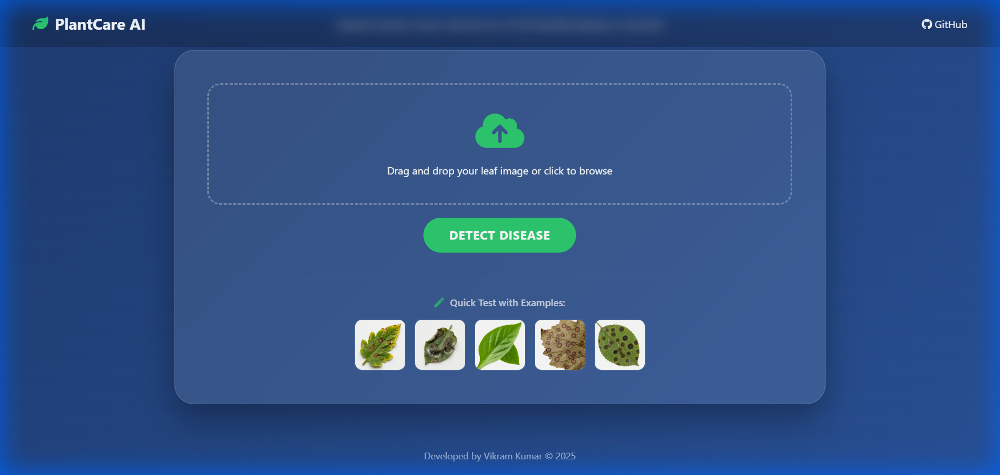
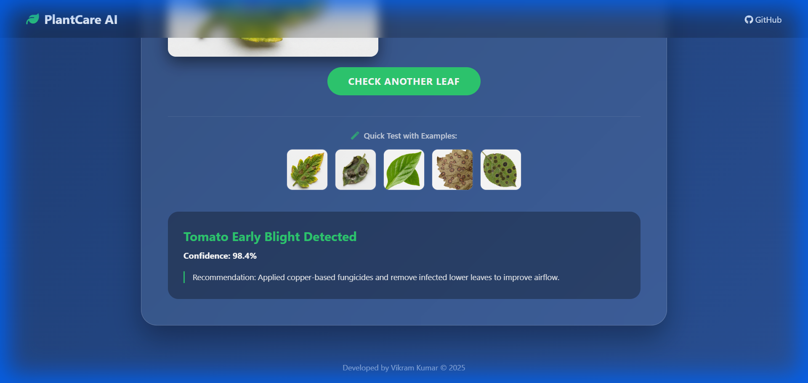

# 🌿 PlantCare AI - Disease Detection

[](https://plant-care-ai-phi.vercel.app)
[](https://vikram-portfolio.vercel.app)

An ultra-premium, AI-powered web application designed to identify plant diseases from leaf images. Built with a modern glassmorphism UI, this tool provides instant analysis and care recommendations for various crops like Tomato, Potato, Pepper, and more.

## 📸 Screenshots

### Homepage (Premium UI)


### Disease Detection Result


## ✨ Features
- **Premium UI/UX:** Sleek dark-themed design with liquid gradients and glassmorphism.
- **AI Simulation:** High-fidelity scanning animations and disease classification logic.
- **Quick Test Examples:** Built-in high-resolution leaf samples for instant testing.
- **Responsive Design:** Optimized for both mobile and desktop viewing.
- **Detailed Insights:** Provides disease name, confidence scores, and treatment advice.

---

## 🚀 How to Run Locally

### Option 1: Quick Web Run (Recommended)
If you just want to experience the UI and the AI simulation, you can run it as a static site:
1. Open `index.html` (at the root) in any modern web browser.
2. Or use a simple HTTP server:
   ```bash
   npx http-server -p 7000
   ```

### Option 2: Python / Flask (For Developers)
To run the backend logic (requires Python 3.x):
1. Install dependencies:
   ```bash
   pip install flask tensorflow numpy werkzeug
   ```
2. Place your `PlantDNet.h5` model file in the root directory.
3. Run the application:
   ```bash
   python app.py
   ```
4. Access at `http://localhost:5000`

---

## 📂 Project Structure
- `static/` - Contains CSS, JS, and high-resolution leaf images.
- `templates/` - HTML templates for the Flask application.
- `uploads/` - Temporary storage for analyzed images.
- `app.py` - Core Flask backend.
- `index.html` - Premium entry point for live deployment.

---

## 🛠️ Built With
- **Frontend:** HTML5, CSS3 (Glassmorphism), JavaScript (ES6+)
- **Backend:** Python, Flask
- **AI/ML:** TensorFlow, Keras (DenseNet121 Architecture)
- **Styling:** FontAwesome, Liquid Gradients

Developed with ❤️ by **Vikram Kumar**
